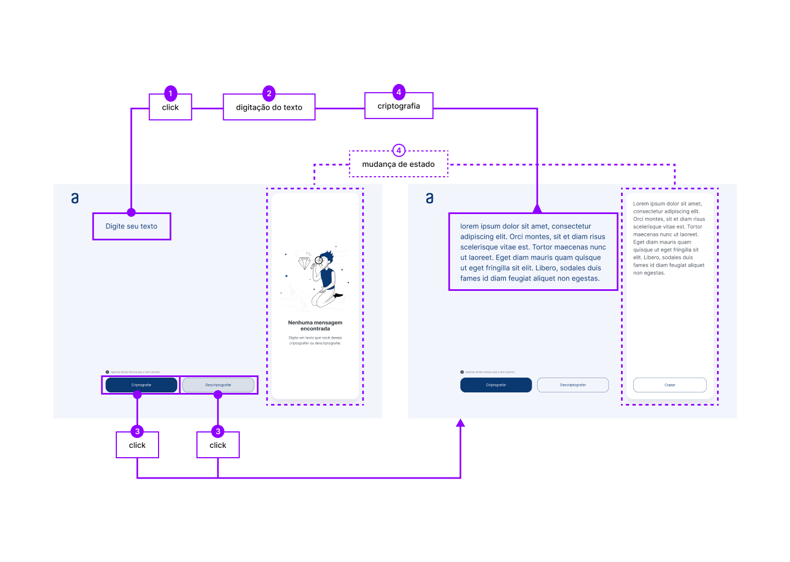

## Sobre

Este é um trabalho para o programa [One](https://www.oracle.com/br/education/oracle-next-education/) Oracle + Alura, onde o desafio se trata de trabalhar em uma aplicação que criptografa textos, permitindo que outras pessoas troquem mensagens secretas sem que saibam o segredo da criptografia utilizada. 

1. As "chaves" de criptografia
   - A letra "a" é convertida para "ai"
   - A letra "e" é convertida para "enter"
   - A letra "i" é convertida para "imes"
   - A letra "o" é convertida para "ober"
   - A letra "u" é convertida para "ufat"

Exemplo

| input | output |
|     :---:      |:---         |
| "g**a**t**o**"  | "g**ai**t**ober**" |
| "g**ai**tober"  | "g**a**to" |

 

2. Requisitos
    - Deve funcionar apenas com letras minúsculas;
    - Não devem ser utilizados letras com acentos nem caracteres especiais;
    - Deve ser possível converter uma palavra para a versão criptografada e também retornar uma palavra criptografada para a versão original;
    - A página deve ter campos para inserção do texto a ser criptografado ou descriptografado, e a pessoa usuária deve poder escolher entre as duas opções;
    - O resultado deve ser exibido na tela.

+Extras: um botão que copie o texto criptografado/descriptografado para a área de transferência - ou seja, que tenha a mesma funcionalidade do ctrl+C ou da opção "copiar" do menu dos aplicativos.

## Design & development

O app é responsivo e foi desenvolvido como desktop-first. Os layouts foram feitos no software Figma e seu desenvolvimento composto por códigos em HTML, CSS e JS puros.

 

 
[E-cript on Figma - @hugobrandaodesa](https://bit.ly/ecript-figma-hugobrandaodesa)

## Planning

- [x] Desenvolvimento em HTML, CSS, JS puros;
- [x] Responsive design desktop & mobile;
- [ ] Dark mode theme;
- [ ] Atualização de estilos e design;
- [ ] Imersão React (long-long-term);
- [ ] Desenvolvimento em React (come back);

## Rewards

